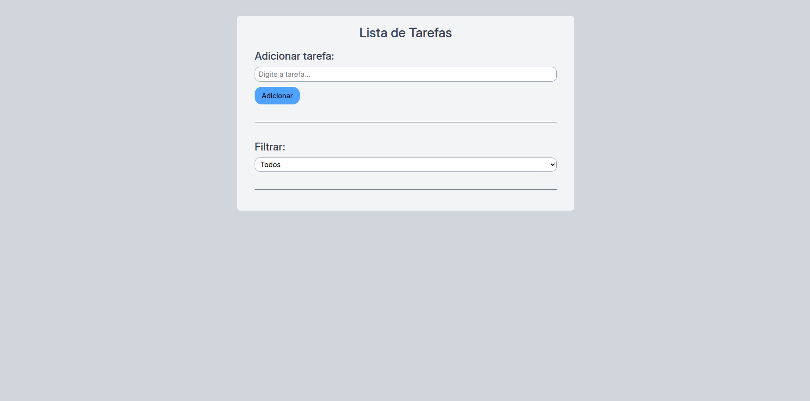

# To do list

## Sobre o projeto

Este projeto foi desenvolvido com o objetivo de aprimorar habilidades deixando o site com
um visual responsivo, limpo e interativo.

## Funcionalidades

- Interface responsiva e minimalista
- Adicionar, remover e marcar as tarefas como concluidas
- Select de filtrar tarefas

## Tecnologias usadas

- React
- Vite
- TailWind Css

## Como rodar

git clone https://github.com/renanmiguel2/ToDoList

## Requisitos

Node.js 17+

## Acesse meu projeto

https://rntodolist.netlify.app/